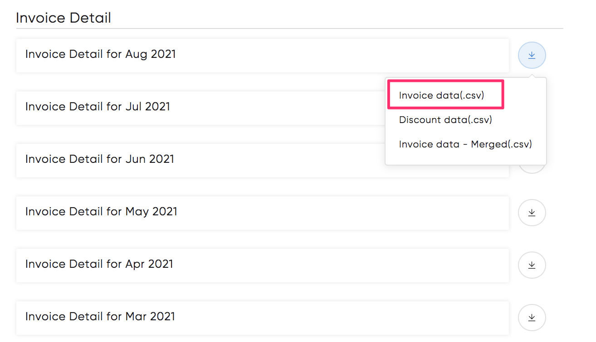
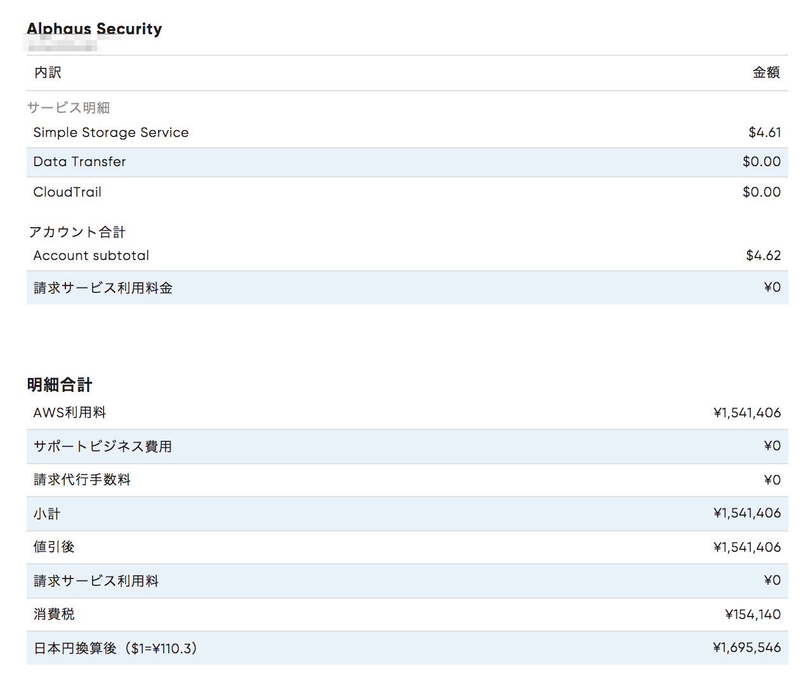

# ご利用明細

ご利用明細のメニューをクリックすると新しいウィンドウが開きます。各月の右横ダウンロードボタンから月単位での請求データのCSVダウンロードが可能です。

月を選択していただくと請求画面にてアカウントのサービス単位での利用料、ページ最下部にはその合計金額や最終的な請求額が記載されています。

右上の歯車マークから請求書ページ内での表示言語の設定、Printボタンから印刷が可能です。

