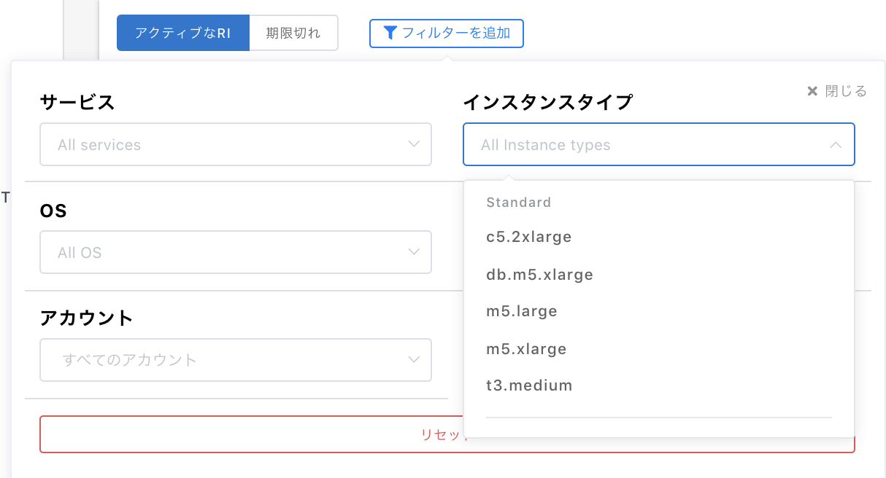

# リザーブドインスタンス

購入したリザーブドインスタンスの管理ページです。


プランによってはリザーブドインスタンスページは表示されません。


## 1. 購入済み 

購入済みのリザーブドインスタンスの一覧を確認できます。

1行ごとに購入したRIの種類が表示され、ドロップダウンから詳細が確認できます。

ページ上部のアクティブな RI では有効期間内のリザーブドインスタンスが表示され、期限切れのタブにて過去のリザーブドインスタンスが確認できます。

#### &#x20;閲覧できる情報

* **サービス**：EC2、RDSなどRIを所有しているサービスが表示されます。
* **インスタンスタイプ**：インスタンスファミリー、クラスからなるインスタンスのタイプが表示されます。
* **OS**：該当するプラットフォームを表示しています。
* **リージョン**：実際にインスタンスが稼働したAZが記載されます。
* **量**：購入した数量が記載されます。
* **Usage type**：
* **購入日**：該当のRIを購入した日時が記載されます（UTCベース）
* **期限：**RIの期限が記載されます（UTCベース）
* **アンブレンデッドプライス**：月額の課金額（前払いなし、一部前払い時のみ費用発生）
* **前払い金額**：購入時に前払いした金額。
* **支払いオプション**：スタンダード・コンバーチブル、期間（１年・3年）、購入方法（全額前払い・一部前払い・前払いなし）
* **アカウント名**：RIを購入したアカウント名。
* **アカウントID**：RIを購入したアカウントID。

フィルターで絞り込みが可能です。

