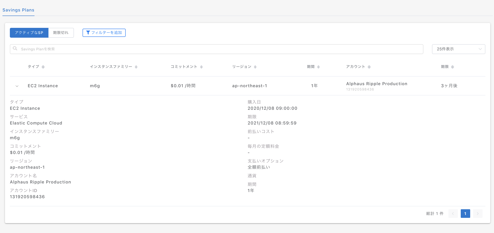

# Savings Plans

購入した Savings Plans の管理ページです。


プランによっては Savings Plans ページは表示されません。


1行ごとにコミットした Savings Plans が表示され、ドロップダウンから詳細が確認できます。

ページ上部のアクティブな SP では有効期間内の Savings Plans が表示され、期限切れのタブにて過去の Savings Plans が確認できます。

* **タイプ:** EC2 Instance, Compute, AWS SageMaker
* **サービス**：EC2、RDSなどSPsの適用対象サービスが表示されます。
* **インスタンスファミリー**：EC2 Instance SPs の場合は購入したインスタンスファミリーが表示されます。
* **コミットメント**：時間あたりのコミット金額。
* **リージョン**：対象のリージョン。
* **アカウント名**：SPs を購入したアカウント名。
* **アカウントID**：SPs を購入したアカウントID。
* **購入日**：該当の SPs を購入した日時が記載されます（UTCベース）
* **期限：**該当の SPs の期限が記載されます（UTCベース）
* **支払いオプション**：全額前払い・一部前払い・前払いなし
* **期間：**1年もしくは3年

.png>)

フィルターで絞り込みが可能です。
