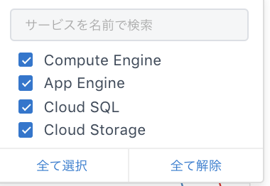

# レポート

レポートでは、GCPの各プロジェクトの利用状況をグラフで確認できます。

### グラフ

Waveのグラフは、GCPのサービスごとに使用状況を可視化します。

サービス単位ではなく、全サービスの合計を見たい場合は`トータル表示`のチェックボックスにチェックを入れてください。

フィルターを活用すれば、自分が見たいデータだけをグラフに表示できます。デフォルトでは、利用されている上位10個が選択されている状態です。


日次グラフ（デイリー）について

更新タイミング：毎日\
データ鮮度：約2日前のデータ\
グラフに含まれない内容：Marketplaceの費用、ドメイン購入費用、サポート費用、返金など



月次グラフ（マンスリー）について

更新タイミング：毎日\
データ内容：当月1日〜約2日前までのデータの累積\
\* 最終的に先月分の月次データ金額が確定するのは請求金額が確定した後です。\
グラフに含まれない内容：Marketplaceの費用、ドメイン購入費用、サポート費用、返金など

