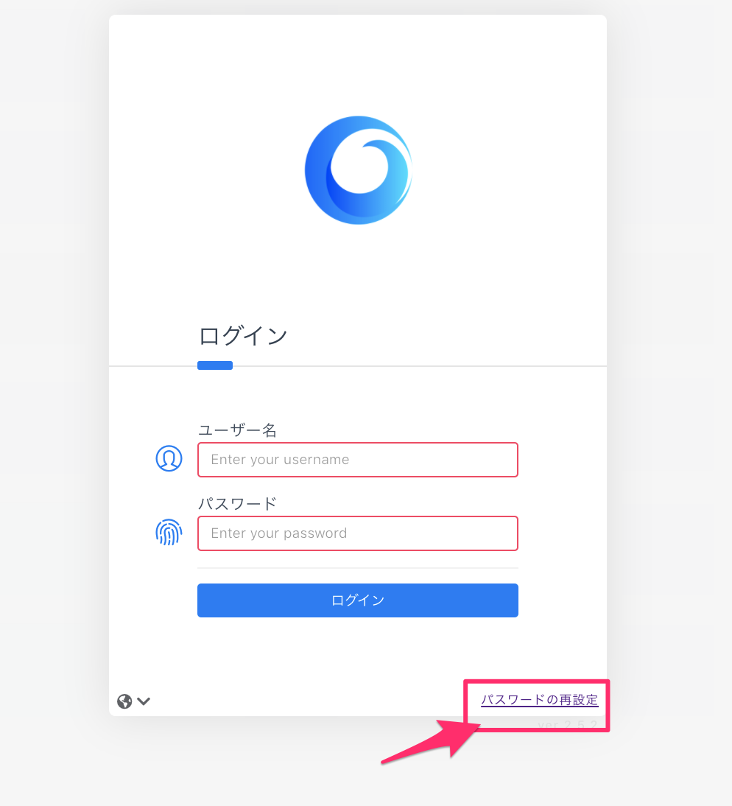

# 各種設定・変更

コンソール右上のドロップダウンメニューから設定を選択します。

 (1).png>)

### 設定画面でできること

1. 環境設定
   * 言語設定：日本語、英語に対応しています。\

2.  アカウント設定

    * パスワードの変更\
      現在のパスワードを入力することにより新しいパスワードを指定できます。現在のパスワードを忘れてしまった場合はお手数ですが、[ログインページより再設定](https://app.alphaus.cloud/wave/login)をお願いいたします。

3.  ユーザーの管理

    * ユーザー管理画面に遷移します。サブユーザーの作成や権限の振り分けが可能です。詳しくは[こちら](https://docs.alphaus.cloud/v/wave/for-all/rbac)をご覧ください。

4.  セキュリティ

    * 2段階認証を有効化できます。

5. APIアクセストークン
   * API利用時のアクセストークンが作成できます。\

6. IdP設定
   * SAML認証を使用したシングルサインオンの設定が可能です。

## パスワードの再設定 

パスワードを忘れた際にログインページからのリンクで再設定できます。

1. `パスワードの再設定`をクリック
2. メールアドレスを入力
3. メールに通知された6桁の番号を入力して認証
4. パスワードを再設定
